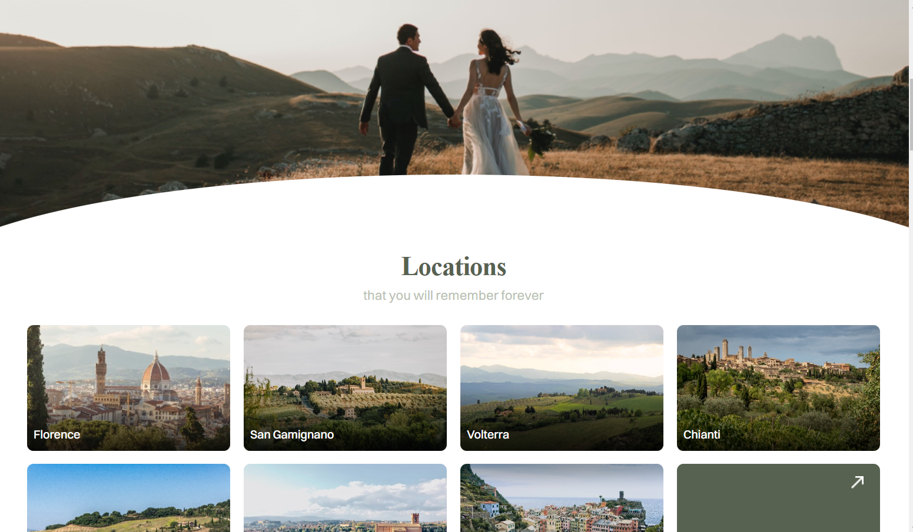
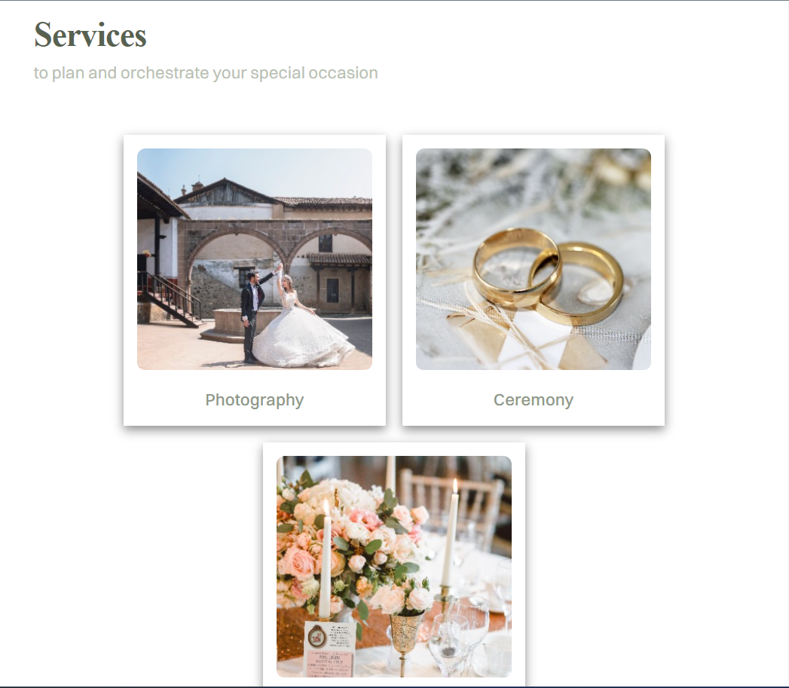

# Discover
>This is a simple wedding themed website that adapts to any device. The site was created from a layout in "Figma".

### Tech stack
* [X] **HTML**: A markup language used to create the structure and skeleton of a web page.
* [X] **SCSS**: Is a syntax that is an extension of Sass and provides compatibility with the standard CSS syntax. It allows you to use all the capabilities of Sass, as well as maintain syntactic compatibility with CSS.
* [X] **Figma**: is a web-based design and prototyping service that allows developers to create vector graphics, mockups, and user interfaces right in the web browser.
* [X] **JavaScript**: Used to add interactivity and dynamic behavior to a web page. It can be used to implement various functions such as animations, transitions to other pages, form validation and much more.
* [X] **BEM Naming**: A methodology for naming classes in CSS that promotes structure and ease of code understanding. BEM (Block, Element, Modifier) allows you to create web page components that can be easily reused and modified.

___

[Link to the site with the *Discover*](https://rss-777.github.io/Discover/)

___
### Screenshot

    
    
    

